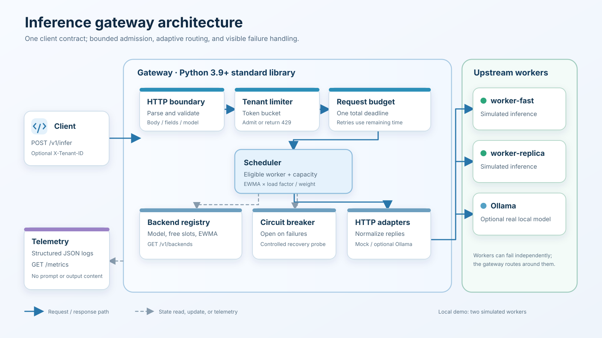
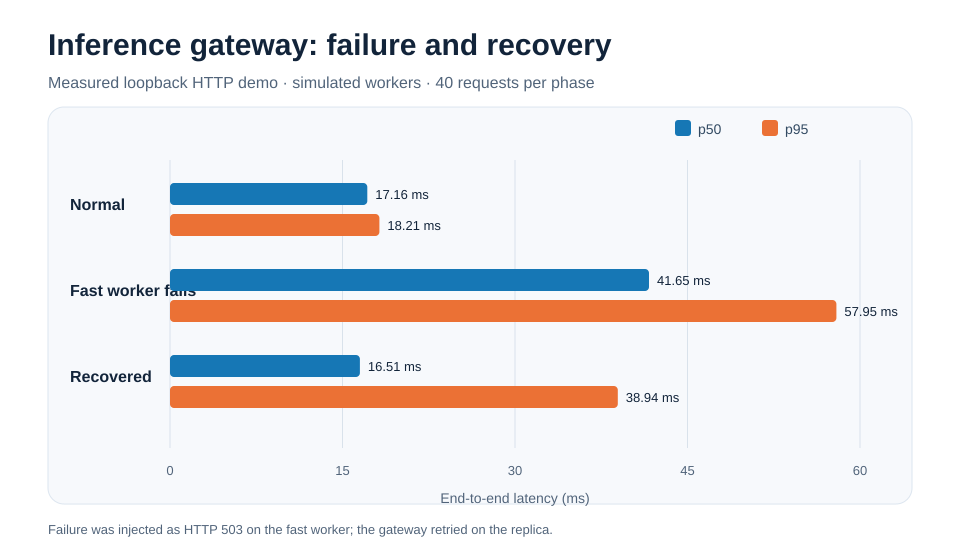
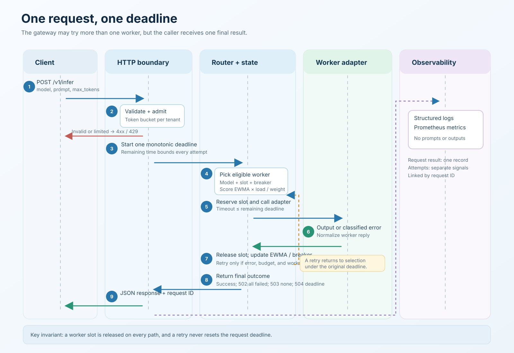

# Project 01: Inference Gateway

An inference gateway gives an application one HTTP endpoint even when several model workers serve the same model. This project implements that request path: validate and admit a request, choose a worker with spare capacity, keep the entire operation inside one deadline, retry another worker after an upstream failure, and expose the decision through logs and metrics.

The default workers **simulate inference**. They return a marked echo of the prompt, so anyone can exercise routing and failure recovery without a cloud account or GPU. An optional Ollama adapter can call a real model running locally. The gateway code itself uses Python's standard library.



## Why this project

Inference infrastructure jobs ask engineers to make a model endpoint reliable under changing load and worker failures. A working gateway makes those concerns inspectable: a reviewer can send a request, watch which backend handled it, inject a worker failure, see failover, and inspect the resulting measurements. The [role alignment and job research](docs/role-alignment.md) explains how this scope relates to Perplexity's Berkeley new graduate posting and current infrastructure postings. The [specification](docs/spec.md) states the requirements and acceptance checks; the [design document](docs/design.md) explains the choices in more depth.

## Run the whole demo in one command

From the repository root, with **Python 3.9 or newer**:

```bash
cd project01-inference-gateway
python3 -m scripts.demo
python3 -m scripts.render_results
```

`scripts.demo` starts two simulated workers and the gateway on available loopback ports. It warms the router, sends 40 requests during normal operation, makes the faster worker return HTTP 503 for another 40 requests, then restores it and sends 40 more. It checks that all three phases succeed, that the failure phase exercises a retry, and that recovery sends traffic to the restored worker. Servers shut down when the command ends. The raw, machine-specific result is saved in [docs/demo-results.json](docs/demo-results.json); the second command regenerates this chart from that JSON:



The checked-in example run reports 40/40 HTTP 200 responses in each phase and five requests with more than one upstream attempt during the failure phase. Client p95 latency was 18.21 ms in normal operation, 57.95 ms during the injected failure, and 38.94 ms after recovery. These are **loopback HTTP measurements with simulated workers**, not model throughput, GPU performance, or a general latency guarantee. Rerunning the demo replaces the JSON and chart with measurements from your machine.

## Run the services and send a request

Open three terminals in this directory. Start the two local workers:

```bash
python3 -m gateway.mock_worker --name worker-fast --port 9001 --latency-ms 12
```

```bash
python3 -m gateway.mock_worker --name worker-replica --port 9002 --latency-ms 35
```

Then start the gateway using [config/local.json](config/local.json):

```bash
python3 -m gateway --config config/local.json
```

In a fourth terminal, call the stable API:

```bash
curl -sS http://127.0.0.1:8080/v1/infer \
  -H 'Content-Type: application/json' \
  -H 'X-Tenant-ID: reviewer' \
  -d '{"model":"demo-text","prompt":"Explain a reliable model service","max_tokens":32}'
```

A successful response has this shape. IDs, timing, backend choice, and token counts vary:

```json
{
  "request_id": "7b45e83c7d6246fbafda9ed41a9403e5",
  "model": "demo-text",
  "output": "[simulated completion] Explain a reliable model service",
  "backend": "worker-fast",
  "attempts": ["worker-fast"],
  "elapsed_ms": 15.7,
  "usage": {"input_tokens": 5, "output_tokens": 5}
}
```

The mock worker counts whitespace-separated words as tokens. Its output and `usage` are for exercising the gateway contract; they are not language-model output or tokenizer measurements.

Useful inspection calls:

```bash
curl -sS http://127.0.0.1:8080/healthz
curl -sS http://127.0.0.1:8080/readyz
curl -sS http://127.0.0.1:8080/v1/backends
curl -sS http://127.0.0.1:8080/metrics
```

Stop each service with `Ctrl+C`. The servers bind only to the local machine.

## How one request moves through the system



1. The HTTP boundary assigns a request ID, enforces body and field limits, and rejects malformed input before contacting a worker.
2. A per-tenant token bucket admits the request or returns `429`. `X-Tenant-ID` defaults to `anonymous` if omitted.
3. The router starts one monotonic deadline for the whole upstream operation. Every backend attempt uses the smaller of its own timeout and the remaining request budget.
4. The registry selects a backend that serves the model, has a free slot, and has a closed circuit or an available recovery probe. Selection uses recent latency, current load, configured weight, and a deterministic name tie break. The slot is reserved under a lock.
5. An adapter calls the selected backend. A failed attempt increments attempt metrics, updates the circuit, releases the slot, and may lead to a different backend within the original deadline. A backend is attempted at most once per client request.
6. The gateway returns one final JSON response and records one request outcome. Upstream attempts are measured separately.

The registry starts every backend at a 50 ms latency estimate. After each successful response it updates that estimate with 30% of the latest latency and 70% of the previous value. The selection score is `estimated_latency_ms × (1 + inflight / capacity) / weight`; a cooled-down backend gets one prioritized recovery probe. Consecutive failures open its circuit at the configured threshold. This is a small, observable scheduling policy, not an optimal scheduler for every workload.

## HTTP and worker contracts

### Client API

`POST /v1/infer` requires `Content-Type: application/json`, a JSON object, and these fields:

| Field | Meaning | Local default limit |
| --- | --- | --- |
| `model` | Configured model name; `demo-text` in the local demo | 1–128 characters |
| `prompt` | Nonempty text to send to the worker | At most 8,192 characters |
| `max_tokens` | Requested output limit; defaults to the smaller of `256` and the configured maximum | Integer from 1 to 1,024 |

The local configuration also caps the complete request body at 65,536 bytes. The optional `X-Tenant-ID` header accepts 1–64 letters, digits, underscores, or hyphens. It is a rate-limit label supplied by the caller, **not proof of identity**. A public deployment would need authentication and a trusted source for tenant identity.

A success response contains `request_id`, `model`, `output`, the selected `backend`, an ordered `attempts` **array** of backend names, `elapsed_ms` for upstream routing, and backend-reported `usage`. The array makes failover visible: `["worker-fast", "worker-replica"]` means the first call failed and the second produced the response. The gateway does not independently verify token usage or make it suitable for billing.

Errors from `POST /v1/infer` have this shape:

```json
{"request_id":"...","error":{"code":"rate_limited","message":"Tenant rate limit exceeded"}}
```

| Status | Representative code | Meaning |
| --- | --- | --- |
| `400` | `invalid_json`, `invalid_prompt`, `invalid_model`, `invalid_max_tokens`, `invalid_tenant` | Fix the input. |
| `404` | `unknown_model`, `not_found` | The model is not configured, or the path is unknown. |
| `408` | `request_timeout` | Sending the request body took too long. |
| `411` | `length_required` | Send `Content-Length`. |
| `413` | `body_too_large` | Reduce the body size. |
| `415` | `unsupported_media_type` | Send JSON content type. |
| `429` | `rate_limited` | Back off; the response includes `Retry-After` in seconds. |
| `502` | `all_backends_failed` | Every backend attempted for this request failed. |
| `503` | `no_capacity` | No healthy backend had a free slot before an attempt. |
| `504` | `deadline_exceeded` | The overall upstream deadline expired. |

`GET /healthz` answers whether the HTTP process is alive. `GET /readyz` returns `200` when at least one backend circuit is closed, half-open, or past its open-circuit cooldown; otherwise it returns `503`. It does **not** actively contact workers or account for all slots being full. A circuit can still appear `open` in `/v1/backends` until the next request starts its recovery probe. `GET /metrics` exposes Prometheus text. Unknown GET paths return `404`.

### Backend protocols

The default `contract` adapter sends `POST /infer` with `{ "model", "prompt", "max_tokens" }`. It expects HTTP 200 JSON with string `output` and optional object `usage`. The optional `ollama` adapter sends non-streaming `POST /api/generate`, maps `max_tokens` to `options.num_predict`, and maps Ollama's `response` and token counts into the common result. Backend replies above 1 MiB and malformed replies count as failed attempts.

## Configure a local model with Ollama

The file [config/ollama.example.json](config/ollama.example.json) shows one local Ollama backend at `127.0.0.1:11434` serving `gemma3:1b`. Install and run Ollama separately, make sure that exact model is available locally, then start the gateway with:

```bash
python3 -m gateway --config config/ollama.example.json
```

Send the same `POST /v1/infer` shape with `"model":"gemma3:1b"`. This example uses port 8080, so stop the mock-backed gateway first. Model download, model output, and latency depend on your own Ollama installation and hardware; the recorded demo does not exercise this path.

## Observe and troubleshoot

The gateway writes structured JSON events to stderr for process start/stop, failed backend attempts, and completed inference requests. Completion records include request ID, status, outcome, elapsed time, and backend/attempt count on success. They omit prompt and output content. `/metrics` reports `gateway_requests_total` by outcome, `gateway_backend_attempts_total` by backend and result, a `gateway_request_duration_seconds` histogram, and backend inflight, latency estimate, and circuit gauges. Metrics and backend state live in memory and reset on restart.

If a request fails, start with `/healthz`, then `/readyz`, then `/v1/backends`. A live gateway can still have every worker circuit open. Check the gateway's stderr for `backend_attempt_failed` events and inspect `/metrics` for the overall result and individual attempts. A `502` means workers were tried and failed; a `503` means the router had no eligible slot when it tried to select one. If the demo ports are occupied, use the one-command demo, which chooses available ports automatically.

The optional standalone load generator sends requests to a running gateway:

```bash
python3 -m scripts.benchmark --url http://127.0.0.1:8080 --requests 100 --concurrency 4
```

It reports status counts, backend choices, requests with retries, throughput, and client-observed p50/p95/p99 latency. These numbers describe that machine and workload only. The default local rate limit is 120 requests per minute with a burst of 20 per tenant; larger benchmark runs may receive `429` unless you adjust the local configuration.

## Tests and verification

Run the automated tests from this directory:

```bash
python3 -m unittest discover -s tests -v
```

The suite exercises the request boundary, configuration checks, rate limiting, capacity reservation, breaker transitions, routing failover, and failure responses. The demo is a separate integration check with three measured scenarios. The [specification](docs/spec.md) lists acceptance criteria; [testing results](docs/testing.md) record the actual checks and their outcomes. The committed [demo result](docs/demo-results.json) is the evidence for the illustrated local run; it is not a substitute for running the tests on your system.

## Scope and next steps

This is a single-process reference implementation. Worker state, token buckets, and metrics are in memory; replicas would need coordinated or sharded state. There is no built-in authentication, TLS, streaming output, active worker health probe, request queue, or durable retry/idempotency record. The local worker is deliberately simulated. Prompts can be processed more than once after a timeout or failover, so callers should not assume exactly-once execution.

A production extension would add authenticated tenant identity, trusted worker discovery, stronger transport security, distributed admission, real model load tests on disclosed hardware, and explicit service objectives. This repository does not claim production-scale performance from its loopback demo.
